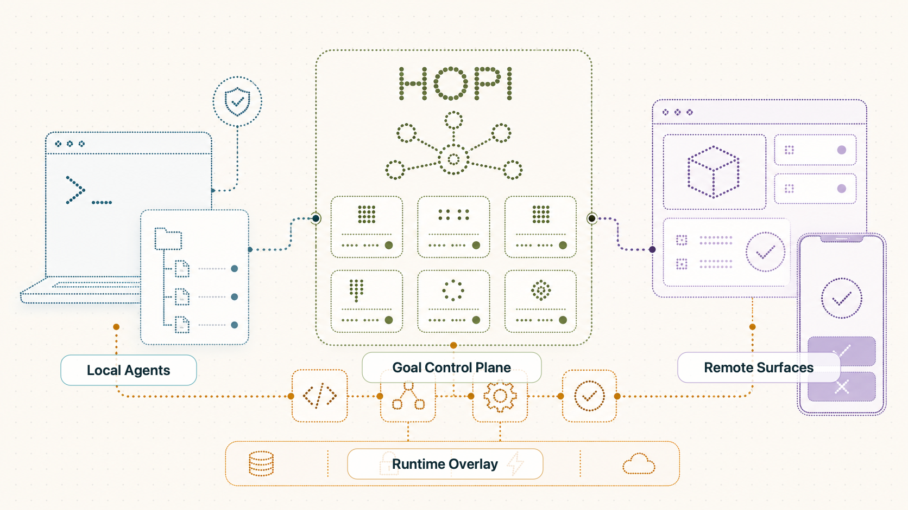
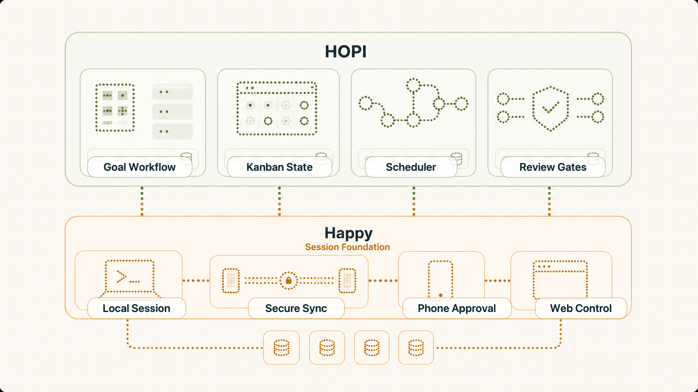
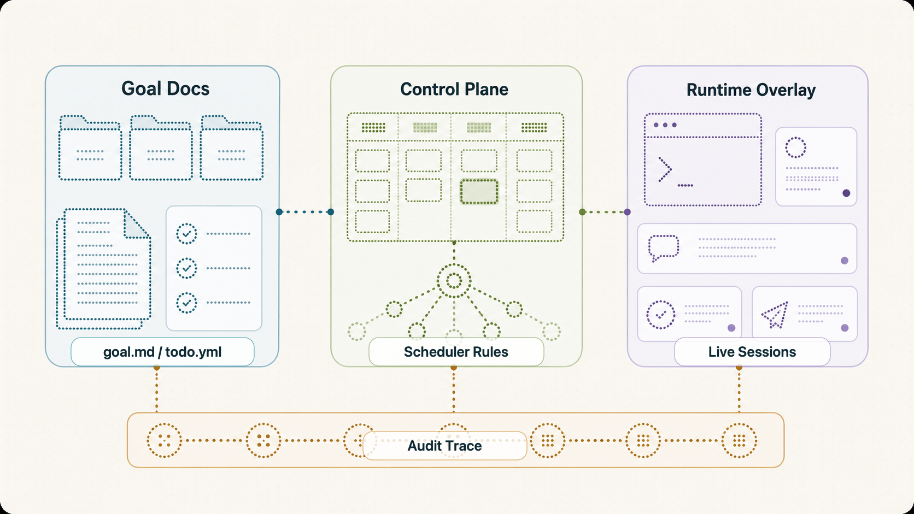
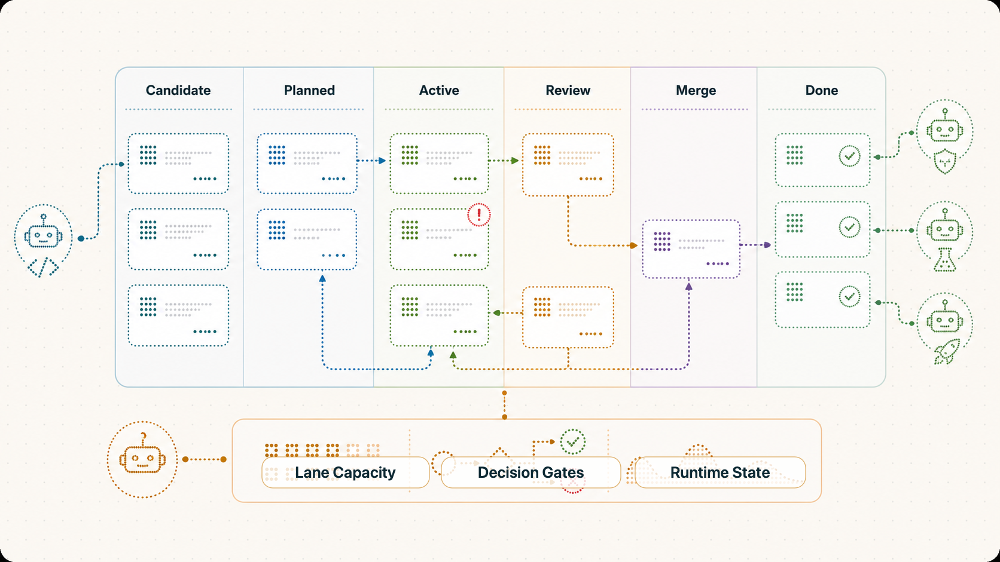
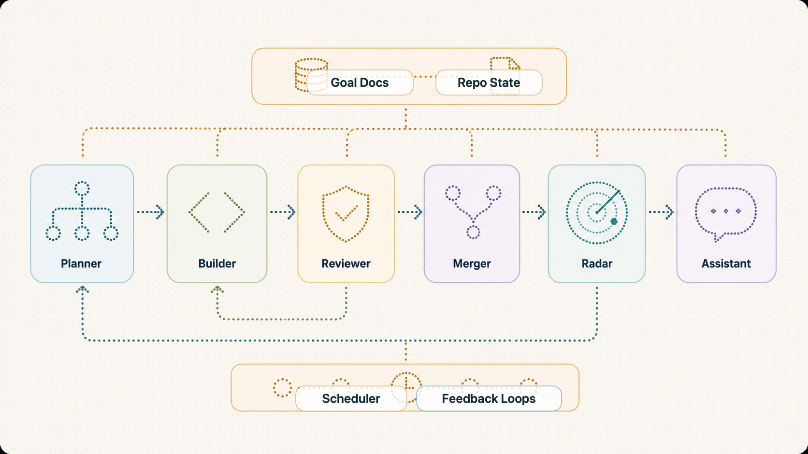
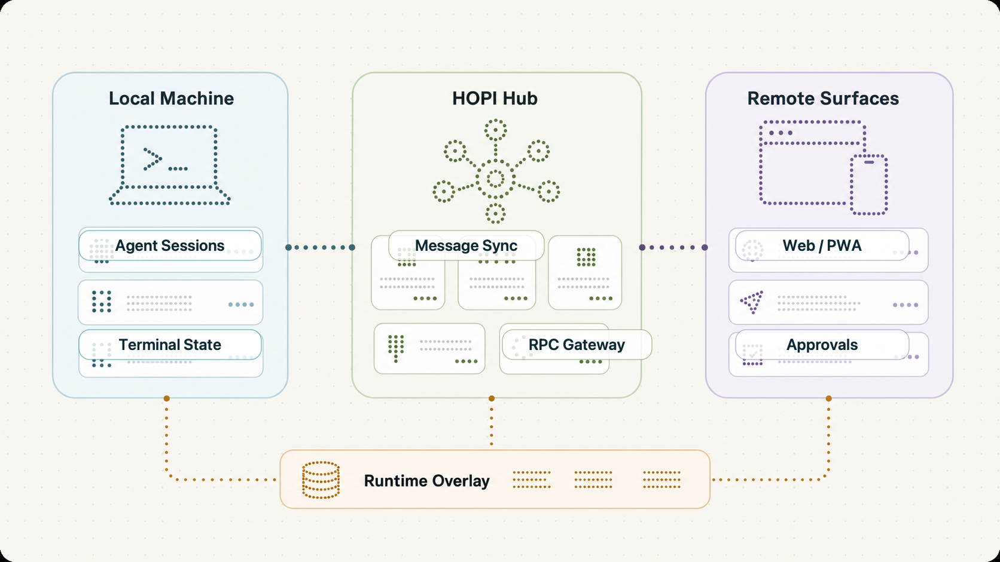

# HOPI

> Note：This is currently only an experimental project to boost my own productivity, and is still in dev, so there may be issues like incomplete documents and unfriendly UX

HOPI is a local-first autonomous development system for keeping AI coding agents working beyond a single chat session.

It started as a personal productivity tool: a way to let Claude Code, Codex, Gemini, and OpenCode keep iterating on real projects while I am away from the keyboard. The interesting part is not just remote control. HOPI turns a product goal into an executable Kanban workflow, then coordinates specialized agents around that workflow with durable state, review gates, dependency rules, and human intervention points.



## Relationship To Happy

HOPI is based on [Happy](https://github.com/slopus/happy), an excellent project for controlling Claude Code sessions from a phone or browser. HOPI keeps the core idea that made Happy useful: native agent sessions can continue running locally while a remote UI handles monitoring, messaging, and approvals.

The reused foundation is intentionally narrow:

- session lifecycle management
- remote connection between local agent runtime and web/mobile surfaces
- live message and state synchronization
- approval-oriented remote control

HOPI's main work is the layer above that foundation: goal-native Kanban, file-native workflow state, multi-agent coordination, deterministic scheduling, decision blockers, review/merge gates, and audit traces.





## The Problem

Most coding-agent workflows are session-native:

- the chat session becomes the planning surface, execution log, and state store
- long-running work is hard to inspect once multiple agents or attempts exist
- dependencies, blockers, review state, and merge state live in prose instead of a workflow model
- remote approval is possible, but the agent still stops when it needs a decision, permission, or next task
- if runtime state and product intent diverge, there is no clear source of truth

HOPI treats those as product problems, not prompt problems.

## Core Idea

HOPI is goal-native. The unit of autonomy is a Goal, not a chat session and not a database task row.

A Goal owns:

- objective and success criteria
- durable design rationale
- Kanban task graph
- dependencies and blockers
- structured decision topics
- workflow trace
- assistant conversation identity
- automation policy

The Kanban board is not just a UI. It is the control plane for autonomous work.



## How It Works

1. A Goal is represented by repo-local docs under `.hopi/docs/goals/<goalKey>/`.
2. `todo.yml` is the canonical Kanban source of truth: task refs, statuses, ordering, dependencies, and blockers.
3. A deterministic scheduler reads `todo.yml`, `decisions.yml`, lane capacity, and runtime overlay to decide what can run.
4. Specialized agents execute different stages of the workflow.
5. The hub stores runtime/session overlay such as messages, attempts, permissions, runner state, and failure summaries.
6. The web app projects durable workflow state plus runtime overlay into a live Goal board.
7. The Goal assistant explains state, resolves interventions, and routes new engineering requests back through visible planner work.

The database is useful, but it is not the workflow authority. If repo-local docs and runtime storage disagree about durable workflow state, docs win.

## Multi-Agent Work Model

| Actor | Responsibility | Boundary |
| --- | --- | --- |
| Planner | Turns product intent into design updates and task graph changes | Owns graph shaping; updates `design.md` before major decomposition |
| Generator | Implements planned work | Runs only when dependencies, decisions, and lane capacity allow |
| Reviewer | Evaluates completed implementation against the acceptance contract | Sends rejected work back to planning or implementation |
| Merger | Merges accepted work and handles merge repair | `done` means merge succeeded, not merely review passed |
| Radar | Scans for follow-up work during idle windows | Adds candidate or planner work through the Kanban path |
| Assistant | Goal-scoped operator/CTO assistant | Explains blockers, records user decisions, retries/resumes existing work; does not become a hidden coding agent |
| Scheduler | Deterministic control plane | Starts eligible runtimes; does not invent workflow truth |

This separation is intentional. The assistant can explain and operate the system, but Planner remains the only actor that reshapes engineering work. Worker agents can report outcomes, but durable Kanban mutations go through the same local-doc control path.



## File-Native Workflow

HOPI keeps durable project state in the repository:

```text
.hopi/
  preference.md
  docs/
    index.md
    goals/
      <goalKey>/
        goal.md
        design.md
        todo.yml
        decisions.yml
        events.jsonl
        write-trace.jsonl
  skills/
    kanban/
      SKILL.md
      todo.mjs
      yaml.mjs
```

Key design choices:

- `todo.yml` owns Kanban workflow truth.
- `decisions.yml` owns structured blocking and non-blocking decisions.
- `events.jsonl` explains workflow mutations but is not replayed to recover board state.
- `write-trace.jsonl` audits agent file writes without storing full source content.
- project-local Kanban scripts validate refs, legal statuses, dependency targets, and dependency cycles.
- writes are atomic and append audit events on successful mutations.

This makes the workflow inspectable with ordinary repo tools. Another process can rebuild the board from files plus runtime overlay.

## Workflow States

Code-changing work follows this progression:

```text
candidate -> planned -> in_progress -> in_review -> merging -> done
```

`candidate` is a reservoir, not executable work. `planned` is dispatchable only when dependencies are satisfied, no blocking decision is open, capacity exists, and a runner is available.

`blocked` is an automation hold, not a separate board lane. A blocked task remains visually attached to its owning workflow lane with a blocker badge such as `Blocked by decision`, `Merge blocked`, or `Permission required`.

## Runtime And Remote Control

HOPI still preserves the original remote-control workflow:

- run official Claude Code, Codex, Gemini, or OpenCode sessions locally
- connect the CLI to the hub over Socket.IO
- control sessions from Web/PWA or Telegram Mini App
- approve permissions from a phone
- inspect files, git diff, terminal output, messages, and agent state remotely
- receive live updates through SSE

The remote layer is not a replacement for native agents. HOPI wraps them, keeps their terminal workflows intact, and adds orchestration around them.



## Architecture

```text
CLI / Runner
  wraps Claude Code, Codex, Gemini, OpenCode
  reports messages, state, permissions, terminal, and RPC handlers

Hub
  HTTP API, Socket.IO, SSE, Telegram bot, SQLite runtime overlay
  reconciles docs state with live sessions and fan-out events

Web / PWA
  Goal board, session chat, approvals, terminal, files, git diff
  renders workflow truth from docs plus runtime overlay

Shared
  TypeScript types, Zod schemas, socket contracts, message utilities
```

Tech stack: TypeScript, Bun workspaces, React, TanStack Router/Query, Socket.IO, SSE, SQLite, Zod, Vite, Telegram Mini App, and agent-specific CLI/ACP integrations.

## Why This Matters

The project explores a practical direction for autonomous software development:

- make work durable outside chat transcripts
- make agent coordination visible instead of implicit
- keep the source of truth local and versionable
- separate planning authority from execution authority
- let deterministic software decide eligibility, not another LLM
- preserve human approval and decision points without stopping the whole loop

The result is an always-on development loop where agents can continue planning, implementing, reviewing, merging, and surfacing blockers while the user supervises from desktop or phone.

## Current Status

HOPI is an active personal tool and experimental platform. The canonical design for the Goal/Kanban/assistant system lives in:

- [docs/hopi-goal-kanban-assistant-unified-design.md](docs/hopi-goal-kanban-assistant-unified-design.md)

The previous public-facing README has been preserved as:

- [README.backup.md](README.backup.md)

## Quick Start

```bash
npx @twsxtd/hopi hub --relay
npx @twsxtd/hopi
```

The terminal prints a URL and QR code. Open it from a browser or phone to monitor and control the local agent session.

Build from source:

```bash
bun install
bun run build:single-exe
```

## Repository Layout

```text
cli/     CLI binary, agent wrappers, runner daemon
hub/     HTTP API, Socket.IO, SSE, scheduler/runtime overlay, Telegram bot
web/     React PWA for sessions, Goal board, approvals, terminal, files
shared/  Common types, schemas, socket contracts, utilities
docs/    Product and architecture documentation
website/ Marketing site
```

## More Documentation

- [CLI](cli/README.md)
- [Hub](hub/README.md)
- [Web](web/README.md)
- [Installation](docs/guide/installation.md)
- [How it Works](docs/guide/how-it-works.md)
- [Voice Assistant](docs/guide/voice-assistant.md)
- [Why HOPI](docs/guide/why-hopi.md)
