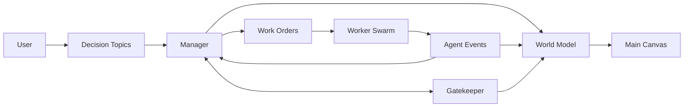
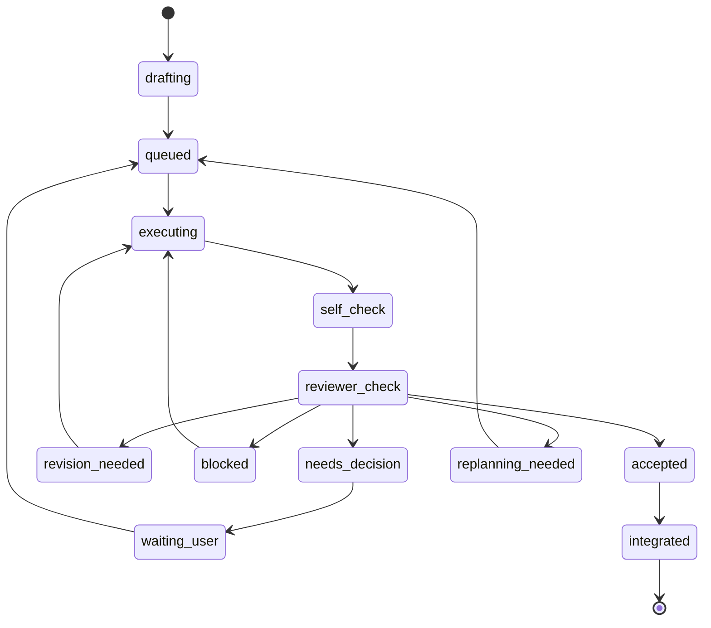
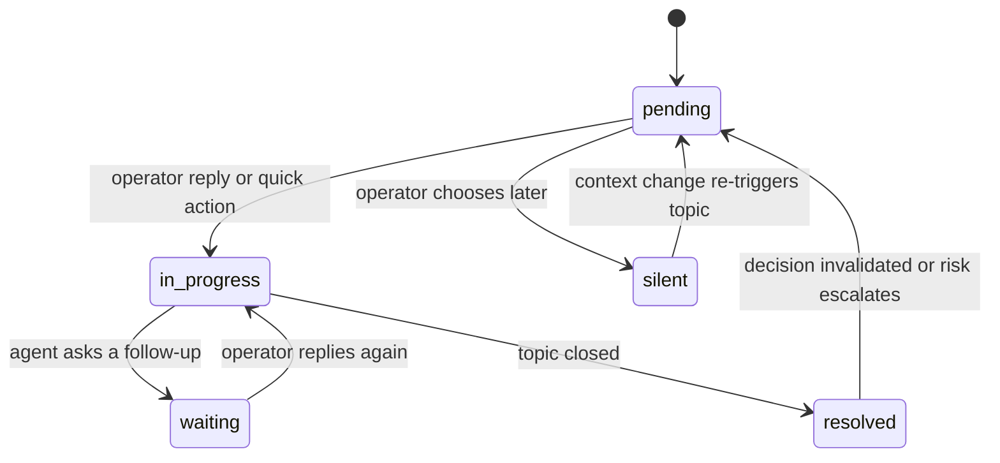

# OMC Multi-Agent State Machine Design

Date: 2026-04-06
Status: Draft for review
Scope: ideal long-term internal state model for OMC message-driven operation

## Summary

Design the ideal internal multi-agent model behind OMC so that:

- user sees one coherent system, not many competing agents
- autonomous work can run for long periods with low interruption
- every interruption is represented as a decision topic in the message workspace
- execution itself is a Ralph-style review loop, not a single pass
- worker capabilities come from skills, not a large fixed cast of specialist agents

Recommended model:

- long-lived roles:
  - `Manager`
  - `Worker Swarm`
  - `Gatekeeper`
- first-class state objects:
  - `WorldModel`
  - `WorkOrder`
  - `DecisionTopic`
  - `AgentEvent`
- each `WorkOrder` runs inside a `Work Cell`:
  - `Driver`
  - `Reviewer`

`Driver` and `Reviewer` are temporary worker roles, not permanent top-level agents.

## Problem

Without a clear internal model, OMC risks three failures:

1. Too many top-level agents
   Multiple "global" agents all read the same project state and produce overlapping judgments.

2. Weak execution loop
   A worker can claim completion too early if there is no explicit reviewer and loop-back path.

3. No stable user boundary
   If every internal event can become a user interruption, the message workspace becomes noisy and loses trust.

## Goals

- keep the long-lived agent set small
- separate execution, boundary judgment, and user conversation
- define how user input changes internal state
- define when a topic becomes a user-visible thread
- make worker execution inherently loop until accepted, escalated, or replanned
- keep the model compatible with skill-based workers

## Non-Goals

- concrete backend implementation
- production transport protocol
- detailed prompt templates
- attempt/session terminal modeling
- human-team multi-user workflow

## Core Roles

### Manager

Single global orchestrator.

Responsibilities:

- maintain the authoritative `WorldModel`
- decide current focus, goal order, and stream priority
- create and update `WorkOrder`s
- interpret user replies
- translate internal events into operator-facing `DecisionTopic`s
- accept or reject completed work at the orchestration level

Does not:

- directly perform task execution
- serve as the detailed reviewer for every work loop

### Worker Swarm

Pool of generic workers.

Properties:

- no permanent specialist identity
- capability selected by skills at runtime
- usually receives local context, constraints, and a narrow work target

Outputs:

- `Observation`
- `Proposal`
- `Constraint`
- `Conflict`
- `Resolution`
- `ReviewerVerdict`

### Gatekeeper

Single long-lived boundary judge.

Responsibilities:

- decide whether autonomous work may continue without interruption
- decide whether a situation should:
  - stay silent
  - append to an existing topic
  - open a new decision topic
  - force a wait for user input
- watch approval boundaries, interruption thresholds, and risk thresholds

Does not:

- own global planning
- execute work

### Work Cell

Temporary inner loop for one `WorkOrder`.

Roles:

- `Driver`
  executes the current step
- `Reviewer`
  checks the result and decides whether the order can proceed

`Driver` and `Reviewer` come from the worker swarm, potentially with different skill bundles.

## First-Class State Objects

### WorldModel

Shared system truth used by the main canvas.

Minimum contents:

- goals
- streams
- current focus
- active work orders
- open decision topics
- approval boundaries
- risk posture
- user directives currently in force

The left canvas reads this model. It does not own decision logic.

### WorkOrder

Internal execution unit created by `Manager`.

Represents:

- one bounded work objective
- its constraints
- current loop state
- current reviewer outcome
- whether it is blocked on user input

### DecisionTopic

Operator-facing thread in the message workspace.

Represents:

- one topic that may require user awareness or judgment
- current lifecycle relative to operator attention
- associated context refs
- messages, quick actions, and directives

### AgentEvent

Structured event passed between internal roles.

Allowed event families:

- `Observation`
- `Proposal`
- `Constraint`
- `Conflict`
- `DecisionRequest`
- `Resolution`
- `ReviewerVerdict`
- `ManagerDecision`

## System Topology

Interpretation:

- users interact through `DecisionTopic`s
- the main canvas reflects `WorldModel`
- `Manager` owns orchestration and external interpretation
- `Gatekeeper` decides user-boundary escalation
- `Worker Swarm` executes through `WorkOrder`s

## WorkOrder Ralph Loop

Execution must be loop-based, not single-pass.

### State Machine

### Meaning

- `drafting`
  manager defining the order
- `queued`
  ready for a work cell
- `executing`
  driver performing work
- `self_check`
  driver verifying its own output
- `reviewer_check`
  reviewer produces verdict
- `revision_needed`
  continue loop with fixes
- `blocked`
  local blocker; may resume after mitigation
- `needs_decision`
  user boundary hit
- `waiting_user`
  topic opened; waiting for user
- `replanning_needed`
  order invalid under current route; return to manager
- `accepted`
  reviewer passed
- `integrated`
  manager accepted into world model

### Reviewer vs Manager

- reviewer gives verdict
- manager makes final orchestration decision

So:

- reviewer can say `accepted`
- manager can still decide whether to integrate now, defer integration, or issue a follow-up work order

## DecisionTopic State Machine

### Rules

- read-only open does not change lifecycle
- replying changes lifecycle
- `silent` means deferred, not solved
- `resolved` may reopen if the environment changes

## User Input Interpretation

Default mode: hybrid.

### 1. Direct command

Example:

`先不要放行，再加固一轮`

Behavior:

- manager interprets as a concrete directive
- updates affected work orders and constraints directly
- may reopen or requeue the relevant work loop

### 2. Intent signal

Example:

`周报别太发散，先做最有把握的版本`

Behavior:

- manager interprets intent
- planner-like reasoning happens inside manager
- updated route may change stream priority, scope, and future decision topics

### 3. Follow-up question

Example:

`为什么现在不先做周报？`

Behavior:

- no forced pause by default
- manager gathers explanation from world model and recent events
- thread moves through conversational states without necessarily changing the route

## Escalation Rules

Internal changes are surfaced by severity class:

- `must decide`
  open a new topic
- `important change`
  append to an existing relevant topic
- `ordinary change`
  update digest or stay silent

This prevents thread spam while keeping important decisions visible.

## Freeze Rules During User Interaction

Default policy: graded freeze.

- reading a thread does not pause work
- asking a question does not pause unrelated work
- threads of kind `approval`, `risk`, or `direction` may freeze the relevant decision boundary
- unrelated streams continue unless the manager determines a broader route change

This keeps the system responsive without letting user-boundary decisions race ahead.

## Conflict Handling

Conflict policy: graded escalation.

- ordinary conflicts:
  manager decides
- conflicts involving:
  - goal changes
  - scope changes
  - approval boundaries
  - risk thresholds
  become decision topics for the user

This keeps the user out of routine agent disagreement while surfacing true business-level tradeoffs.

## Example Flows

### Example 1: Approval boundary

Topic:

`要不要现在放行导入分支`

Flow:

1. manager issues import hardening work order
2. driver completes a round
3. reviewer says result is technically acceptable, but release crosses an operator boundary
4. work order enters `needs_decision -> waiting_user`
5. gatekeeper opens approval topic
6. user replies: `别放，再加固一轮`
7. manager converts this into a directive
8. work order returns to `queued -> executing`
9. loop continues until accepted again

### Example 2: Risk containment

Topic:

`首个券商范围仍偏大`

Flow:

1. execution continues on import stream
2. gatekeeper sees the risk may affect route quality
3. risk topic opens
4. user replies: `先收紧，不要扩范围`
5. manager converts reply into route constraint
6. existing work orders are updated or reissued under the tighter scope
7. topic resolves after route and next work orders stabilize

### Example 3: Pure explanation

Topic:

`当前主线为什么先压导入`

Flow:

1. no hard decision boundary exists
2. status topic is available for operator follow-up
3. user asks why the weekly brief is not first
4. manager explains current route based on world model
5. if user then says `把周报提到最高`, the topic becomes directive-bearing and route changes

## Invariants

- user never speaks directly to raw workers
- workers do not open user-visible topics directly
- main canvas is world-model driven, not thread-driven
- every user-visible topic maps to a decision boundary or meaningful status track
- every work order can loop through review multiple times before acceptance
- skills define worker capability; agent identity stays generic

## Why This Model

This model keeps the system understandable:

- three long-lived roles only
- one global conversational voice
- one shared world model
- explicit inner Ralph loop
- explicit outer decision boundary

It supports long-running autonomy without requiring the user to micromanage plan cards or execution attempts.
