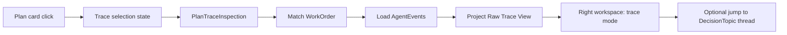

# OMC Plan Raw Run Log Design

Date: 2026-04-06
Status: Draft for review
Scope: right-side raw execution trace viewer for kanban plan cards in `omc-prototype`

## Summary

Add a `Raw Run Log` mode to the existing right-side operator workspace so that clicking a kanban plan card opens the real internal execution trail behind that card.

This is not a summary panel.

It is a trace viewer for:

- `WorkOrder`
- `AgentEvent`
- state transitions inside the Ralph loop
- linked `DecisionTopic`s

The right-side workspace will support three modes:

- `inbox`
- `thread`
- `trace`

The left canvas remains a world-model projection. The right workspace becomes the unified operator surface for:

- decisions
- conversations
- raw execution inspection

## Problem

Current kanban cards only show projected status:

- title
- column
- summary
- badges

They do not expose the real internal model output that produced the card state.

This causes three gaps:

1. No way to inspect raw agent activity
   Users cannot see actual `Driver`, `Reviewer`, `Manager`, or `Gatekeeper` outputs behind a plan card.

2. No bridge between UI cards and inner loop state
   A plan card visually exists, but its relationship to `WorkOrder`s and `AgentEvent`s is hidden.

3. Over-reliance on conversational threads
   Some operator questions are not decision questions. Sometimes the user wants raw run evidence, not another interpreted message.

## Goals

- let users click a kanban card and inspect real internal execution output
- reuse the same right-side workspace instead of opening a new page
- show raw data before summaries
- make `PlanCard -> WorkOrder -> AgentEvent[]` mapping explicit
- distinguish exact mapping from inferred mapping
- gracefully handle cards that have no runtime output yet

## Non-Goals

- replacing message threads
- introducing a new full-screen execution detail page
- replacing the existing left-side kanban
- rendering every internal object in the main canvas
- building a production log search system

## User Experience

### Right Workspace Modes

The right operator workspace supports exactly three modes:

- `inbox`
  decision-topic list
- `thread`
  one decision-topic conversation
- `trace`
  raw run log for one plan card

Transitions:

- `inbox -> thread`
- `inbox -> trace`
- `trace -> inbox`
- `trace -> thread`
  via linked decision topic
- `thread -> trace`
  via linked plan/work order reference

### Trigger

When the user clicks a kanban plan card:

- the right workspace switches to `trace`
- the selected plan becomes the active trace target
- the left kanban remains visible

### Default View

The default trace tab is `Events`.

Reason:

- this is the least interpreted view
- it matches the user request for raw model output
- it makes role and event flow visible immediately

## Approaches Considered

### 1. Product Summary Panel

Show:

- current conclusion
- simplified explanation
- next step

Rejected because:

- too interpreted
- hides raw internal output
- duplicates message-thread behavior

### 2. Bottom Drawer Log

Open a bottom trace drawer below the kanban.

Rejected because:

- compresses board layout
- weak reading path
- worse for cross-referencing multiple cards

### 3. Right-Side Raw Trace Viewer

Open trace in the same right workspace used for messages.

Recommended because:

- consistent operator surface
- keeps left board visible
- supports jumping between decisions and raw execution
- matches the existing two-pane prototype

## Recommended Design

### Workspace Layout

The right workspace stays a single shell, but its content changes by mode.

For `trace` mode:

- top bar
  - back
  - plan title
  - work order id
  - state
  - round
  - mapping confidence
- tab bar
  - `Events`
  - `State`
  - `JSON`
- main area
  - tab content
- bottom area
  - linked decision topics

The trace mode should visually feel closer to a dev trace viewer than a product briefing card.

## Core Model

Introduce a UI projection model:

### `PlanTraceInspection`

Inputs:

- selected `PrototypePlanCard`
- `WorldModel.workOrders`
- `WorldModel.agentEvents`
- `DecisionTopic`s

Outputs:

- trace target metadata
- mapping confidence
- selected `WorkOrder`
- ordered event list
- state transition list
- related decision-topic links

## Plan Card Mapping Rules

### Match Levels

Exactly one match mode is reported:

- `exact`
  `workOrder.planId === planCard.id`
- `inferred`
  no plan-id match, but best candidate found by:
  - same `goalId`
  - same `streamId`
  - same `phaseId`
- `none`
  no suitable work order found

### Exact Match

Primary path. Must be preferred whenever available.

### Inferred Match

Used only when no exact match exists.

The UI must explicitly label this:

- `推断关联`

This prevents users from treating inferred traces as canonical.

### No Match

Show a clear empty-runtime state:

- this card currently has planning data only
- no raw execution output exists yet

## Event Presentation

### Principle

Raw first. Minimal interpretation.

Each event row shows:

- timestamp
- role
  - `driver`
  - `reviewer`
  - `manager`
  - `gatekeeper`
- event type
- raw payload

If payload is plain text:

- display it as-is

If payload is structured:

- show the main fields inline
- allow expansion to full JSON

### Event Types

Expected event families:

- `Observation`
- `Proposal`
- `Constraint`
- `Conflict`
- `DecisionRequest`
- `Resolution`
- `ReviewerVerdict`
- `ManagerDecision`

### Ordering

Default:

- newest first inside the selected tab

Optional grouping:

- by `loop.round`

If round grouping exists, it must not hide raw chronological ordering.

## State Tab

The `State` tab shows explicit Ralph-loop transitions.

Example:

`queued -> executing -> self_check -> reviewer_check -> revision_needed -> executing`

This tab is derived from the selected `WorkOrder` and relevant `ReviewerVerdict` / `ManagerDecision` events.

It should not invent transitions that do not exist in model state.

## JSON Tab

The `JSON` tab shows:

- current `WorkOrder`
- related `AgentEvent[]`

Raw object view. No prose summary.

This is the lowest-level debugging surface for the prototype.

## Linked Decision Topics

Trace mode may show related decision topics, but only as a secondary section.

Rules:

- do not let linked topics dominate the trace surface
- list topic title + lifecycle only
- clicking a topic switches the workspace from `trace` to `thread`

## Empty and Degraded States

### No Runtime Output

If no matching work order exists:

- show the plan card’s planning metadata
- show the message:
  - `这张卡还没有运行态输出，当前只有计划信息。`

### Work Order Exists, No Events

If a work order exists but has no related events:

- show current `WorkOrder`
- show the message:
  - `这张卡已经进入运行态，但还没有记录到原始事件。`

### Inferred Match

If using inferred mapping:

- show a visible but lightweight warning label
- copy:
  - `当前输出按 stream/phase 推断关联，不是 plan 直连。`

## Main Canvas Changes

The left kanban stays intact.

Behavior changes:

- clicking a plan card becomes a first-class interaction
- selected card should visibly highlight while its trace is open
- no navigation to a new page

No approval buttons or decision controls are added to plan cards.

## Data Flow

## Testing

- clicking a kanban card opens right workspace in `trace` mode
- exact plan-to-work-order match is preferred over inferred match
- inferred matches display the correct warning label
- no-match state renders planning-only fallback
- event tab renders raw role, type, and payload rows
- state tab renders loop transitions
- JSON tab renders current work order and event objects
- linked decision topic opens thread mode
- returning from trace mode restores inbox or previous workspace state cleanly

## Open Implementation Notes

- existing prototype scenario data may need richer `AgentEvent` seeding so trace mode is meaningful
- `PrototypePlanCard` selection state likely belongs in the same operator-surface controller as inbox/thread selection
- right workspace shell should remain mode-driven, not route-driven

